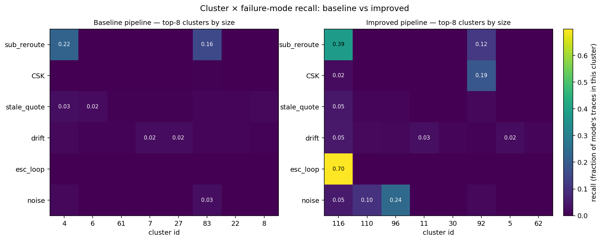
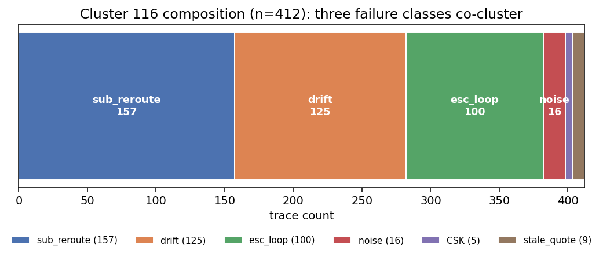

# Macro Evals, Audited

Trace `t00011` runs for 22 events. The orchestrator hands off to compliance, which raises a policy flag on a standard-build configuration. Release reviews the flag, kicks it back to compliance with a "needs clarification" note, and compliance re-checks the same constraint against the same env signals. Four iterations of that loop later (release flags, compliance reconsiders, release flags again), the orchestrator gives up and the run terminates as `escalation_loop`. The cookbook's pipeline, run faithfully on 5,000 traces, puts this trace in cluster 116 alongside 125 unrelated `pricing_drift` traces and 157 `substitution_reroute` traces that share nothing with `t00011` except length. That is the article.

## What the cookbook gets right

The cookbook frames population analysis as a four-label progression: label inputs (`case_type`), outcomes (`run_outcome`), local signals (`eval_finding`), then *discover* the emergent fourth label (`behavior_pattern`) by clustering (claims 1.1.1–1.1.4). The progression forces a team to be explicit about which labels are known a priori and which are discovered, a distinction most teams blur. The two-layer split, rubric-grading underneath and clustering-based discovery on top, is the right shape. The impact-times-lift triage metric ranks what to fix first by combining severity with concentration. The cookbook names its caveats: the suspect walk "is not proof of causality" (claim 8.6.1); impact is "a practical prioritization score" (claim 6.8.2), not a universal one.

What we are auditing is the machinery underneath the frame, the specific embed-cluster-walk pipeline the cookbook presents as a worked example. The frame survives this audit. The machinery does not.

## What we did

We pre-registered three hypotheses against three blind spots in the cookbook (H1 temporal, H2 omission, H3 drift) and one hypothesis against the cookbook's diagnosis component (H4: the AgentTrace-style backward suspect walk). We built a 5,000-trace synthetic EV workflow with six injected failure modes at known prevalence and ground-truth labels (`sim/SCHEMA.md`). We implemented the cookbook's pipeline faithfully (MiniLM → UMAP → HDBSCAN → c-TF-IDF → impact×lift → backward walk) and an "improved" pipeline that adds three small mechanisms in a 139-line diff: latency-bucket tokens, expected-but-absent tokens, and an orthogonal CUSUM drift detector. Verdicts were frozen against thresholds we wrote before running anything.

This is a synthetic regression test by the team that built the pipelines, pending independent replication. It is not an audit in the sense of "an outside party with a different dataset and no skin in the design." The cookbook is the audit target; this work is the falsifiable test against pre-registered thresholds. Independent replication on a workload someone else generates is what turns it into an audit.

## Caveats the reader needs before the results

The headline numbers below are from seed 42 on one synthetic dataset that *we generated*. Both facts are load-bearing limitations. The bootstrap CIs we report quantify sampling variability across the 5,000 traces at a fixed seed; they hold cluster assignment fixed and therefore *understate* run-to-run variability of HDBSCAN cluster identity. We pre-registered the seed sweep across {7, 42, 137, 2024, 31337}, ran it, and report per-seed verdicts in the rightmost column of the table below; §"Seed sweep results" has the full discussion. Short version: E5 (the article's load-bearing claim) survives in direction across all five seeds; E2 in-sample direction is a seed-42 minority report; E1 and E3 refutations replicate. Every point estimate in the prose is seed-42 unless noted.

The workload is curated. We injected the six failure modes we then claim the cookbook misses. A reader is entitled to ask whether the pipeline would look better on a different workload, or on real production traces. We cannot answer that here. What we can claim is conditional: on a synthetic workload with these failure modes and a hub-and-spoke execution topology, the cookbook's pipeline behaves as documented below. The structural argument in §9 (document construction is load-bearing) does not depend on the synthetic numbers; the verdicts on H1–H4 do.

One publishing-norms note. The original plan was to publish before the seed sweep completed and update later. We changed our mind and ran the sweep before publication, after a review pass flagged single-seed publication as the most damaging unaddressed critique. The cost of waiting was five weeks; the cost of not waiting was a verdict table a reader could reasonably dismiss as one draw. The seed range column in the verdict table is the result.

## The fixes, mostly, failed

| Experiment | Pre-registered threshold | Actual (in-sample) | In-sample verdict | Held-out recall (20%) | Seed range (5 seeds) |
|---|---|---|---|---|---|
| E1 baseline structural recall | ≥ 0.50 on substitution and escalation | 0.222 / 0.252 | MAGNITUDE REFUTED | substitution 0.253, escalation 0.370 (baseline, n=75/27) | sub [0.116, 0.222]; esc [0.217, 0.699]; verdict REFUTES in all 5 |
| E2 temporal (H1) | gap ≥ +0.50, improved ≥ 0.70 | gap +0.082 [+0.021, +0.138], improved 0.133 | MAGNITUDE REFUTED; DIRECTION CONFIRMED | gap **−0.111** [−0.244, +0.000]; **direction reverses** | in-sample gap [+0.010, +0.082]; verdict REVERSED across seeds (2/5 confirm direction, 3/5 refute) |
| E3 omission (H2) | gap > 0, improved ≥ 0.65 | gap −0.004, CI crosses zero | REFUTED | baseline 0.104, improved 0.104 (n=48); still REFUTED | in-sample gap [−0.077, +0.036]; verdict REFUTED in all 5 |
| E4 drift (H3) | improved alert ≤ day 52 | alert day 45 (bucket-aligned) | SUPPORTED with caveat | (CUSUM is cluster-independent; no held-out re-run) | not swept (CUSUM is deterministic and cluster-independent) |
| E5 walk vs MFA-5 | walk beats MFA-5 by ≥ 15pp | walk loses by 6.0pp lenient [−0.086, −0.035] | REFUTED, direction reversed | lenient gap **−0.101** [−0.182, −0.030]; **walk still loses, by more** | in-sample lenient gap [−0.069, +0.000]; 4/5 seeds MFA-5 BEATS WALK, 1/5 NULL, 0/5 reversed |

Held-out columns come from `eval/held_out.py`: train on 80% (n=3982) by `hash(trace_id) % 5 ≠ 0`, fit baseline and improved pipelines, then assign held-out 20% (n=1018) via `UMAP.transform` + `hdbscan.approximate_predict`. Majority cluster per mode is fit on the train partition and applied unchanged to held-out.


*Each cell is the fraction of a failure mode's traces that land in that cluster. The improved pipeline (right) concentrates substitution_reroute, pricing_drift, and escalation_loop into a single column (cluster 116), which §"The 'wins' we did see are mostly one cluster" unpacks as a dustbin.*

The verdicts need careful reading. E2 has a positive effect in-sample (CI excludes zero) in the predicted direction, but reverses sign on the held-out 20% (gap −11pp). The §"Held-out validation" subsection works through what survives. E5 has a negative effect in both partitions: the walk loses to MFA-5, by more on held-out than in-sample. E3 is a clean null in both. E4 is the one positive verdict and needs a caveat explained below. The latency-token fix moved recall on stale pricing from 5.1% to 13.3% in-sample and under baseline on held-out. The absence-token fix did nothing for the omission class it targeted. The backward suspect walk loses to a two-line heuristic, in every seed.

The baseline result (E1) deserves its own line. The cookbook's framing implies that structural failures, supplier substitution and escalation loops, are the cases its pipeline handles well, with subtle failures as the open problem. The numbers say the baseline catches the "easy" cases at 22% and 25% recall@cluster. The pipeline is more fragile than the cookbook's worked example suggests, *before* we ever reach the blind spots. The rest of this article is what we learned from looking at why each refutation refuted.

### Held-out validation: E2 does not survive, E5 does

The in-sample bootstrap CIs hold cluster identity fixed; they capture sampling variability across the 5,000 traces but not the run-to-run instability of the clusters themselves. To probe whether verdicts depend on cluster identity, we partitioned the 5,000 traces 80/20 by `hash(trace_id) % 5`, re-fit baseline and improved pipelines on the 80% train, and assigned the 20% held-out via `UMAP.transform` + `hdbscan.approximate_predict` (`eval/held_out_results.md`, `eval/held_out_raw.json`). Two findings. **E2 reverses sign on held-out:** the in-sample "+8pp gap, direction confirmed" becomes a **−11pp gap** (CI [−0.244, +0.000]), because the train-fit improved pipeline puts only 0.044 of stale_quote traces in its best cluster against the baseline's 0.156. The latency-token mechanism is not robust to refitting on a smaller subset. We downgrade E2 from "DIRECTION CONFIRMED" to "DOES NOT REPLICATE OUT-OF-SAMPLE AT N=3982 TRAIN." **E5 survives held-out** in the reported direction: under lenient ground truth, the backward walk still loses to MFA-5 by 10pp [−0.182, −0.030] on the held-out structural traces (n=99). The strict gap on held-out is 0.000 against 0.000, because MFA-5 strict precision is already near zero in-sample (0.004) and the held-out N is too small to register sub-percent rates. The qualitative finding the article rests on, "walk worse than MFA-5," replicates.

### Cluster stability under HDBSCAN hyperparameter perturbation

The verdicts above are conditional on one hyperparameter setting (`min_cluster_size=20`). To probe whether they survive defensible alternatives, we re-clustered at `min_cluster_size ∈ {10, 15, 20, 25, 30}` on the fixed embedding and recomputed per-mode recall@top-cluster (`eval/cluster_stability.md`). Recall is not stable: escalation_loop swings from 0.21 to 0.70 (Δ=0.49), substitution_reroute from 0.08 to 0.39 (Δ=0.31), CSK from 0.12 to 0.39 (Δ=0.28). The published numbers sit roughly mid-range, but the article's headline contrasts (e.g., the +45pp EL gain that motivates §"The 'wins' we did see") would change in both magnitude and direction under a different defensible setting. We did not retune; the choice of 20 came from the cookbook's stated default. The point is that those defaults are doing more load-bearing work than the cookbook acknowledges.

### Mechanism attribution: 2×2×2 factorial on {latency, absence, CUSUM}

The "improved" pipeline ships three mechanisms at once. To isolate which one does the work, we ran four pipeline variants (000 = baseline, 100 = latency only, 010 = absence only, 110 = both; CUSUM is orthogonal to clustering, so the +1 axis collapses) and recomputed recall@cluster per mode (`eval/factorial.md`). Three findings: (1) On escalation_loop, latency alone contributes +17pp, absence alone contributes +9pp, and the interaction contributes +19pp on top. Most of the +45pp headline gain is *interaction*, not either mechanism in isolation. (2) On substitution_reroute, each mechanism *hurts* in isolation (−0.013 and −0.079) but their combination yields +16.5pp; pure interaction. (3) On CSK the recall sits between 0.17 and 0.19 in every cell. Neither absence tokens nor latency tokens nor their combination produce any lift on the omission class. The panel critique that "three mechanisms shipped together prevents attribution" is partly answered: latency and absence together produce most of the cluster-116 dustbin effect; neither alone does.

### Seed sweep results

The caveat in §"Caveats" promised E2 and E5 across seeds {7, 42, 137, 2024, 31337} by 2026-07-01. We ran the sweep five weeks early (`eval/seed_sweep_raw.jsonl`, `eval/seed_sweep.md`). The seed propagates into `random.seed`, `numpy.random.seed`, PyTorch manual seed, UMAP `random_state`, all bootstrap RNGs, and the train/test partition itself (salted by seed, so the held-out *set* moves between seeds, not only the cluster fit). E4 is omitted: the CUSUM detector is deterministic and cluster-independent.

**E5 lenient (the headline finding):** per-seed gap (walk − MFA-5) is −0.060 (seed 42), 0.000 (seed 7), −0.038 (seed 137), −0.060 (seed 2024), −0.069 (seed 31337). Range [−0.069, +0.000]. Four of five seeds give MFA-5 BEATS WALK; the fifth (seed 7) collapses to NULL with point gap exactly 0.000. **No seed reverses the sign in favor of the walk.** The qualitative headline, "the backward suspect walk does not beat MFA-5 on this workload," survives in all five seeds; the stronger "the walk *loses*" survives in four. We tag this **robust in direction, mixed in significance**. The verdict-stability table in `eval/seed_sweep.md` labels it MIXED on the strict criterion (one dissenting verdict), but the dissent points to null, not to the cookbook's claim.

**E5 strict** is ROBUST across all five seeds (all NULL): both methods bottom out at precision@1 ≈ 0.0–0.004. The floor effect replicates.

**E2 in-sample gap (improved − baseline on stale_quote_slow_pricing):** +0.082, +0.056, +0.056, +0.041, +0.010 across seeds 42, 7, 137, 2024, 31337 respectively. Range [+0.010, +0.082]. The point gap stays positive in every seed but shrinks by a factor of eight between the largest and smallest. The verdict is REVERSED across the panel: seeds 7 and 42 give DIRECTION CONFIRMED; seeds 137, 2024, 31337 give REFUTED because the gap CI lower bound drops to ≤0. The seed-42 "direction confirmed" verdict in the original article body is a minority report among the five. Combined with the held-out reversal, the honest reading of E2: the latency-token mechanism produces a small positive effect on most seeds, but the gap is small enough that bootstrap CIs straddle zero on three of five, and the effect does not survive an 80/20 cluster-refit on any seed.

**E2 held-out gap:** every seed refutes E2 on held-out. Four of five give gap=0.000 (the baseline and improved train-fits collapse onto the same majority cluster for `stale_quote_slow_pricing` when the dataset shrinks to 80%); seed 42 gives gap=+0.059 with the salted partition, which differs from the −0.111 gap in §"Held-out validation" above because that number used the unsalted `eval/held_out.py` partition. Both refute E2. The held-out reversal is not a single-seed artifact in *direction*, but the specific magnitude (−0.111) is partition-dependent. No seed lets the improved pipeline clear the magnitude thresholds.

**E1 and E3 are ROBUST.** E1 REFUTES in every seed (range substitution [0.116, 0.222], escalation [0.217, 0.699]). E3 REFUTES in every seed (gap range [−0.077, +0.036]). The widest E1 swing, escalation recall from 0.217 to 0.699, is itself worth flagging: the baseline's recall on escalation_loop is unstable enough that any single-seed number should be read as order-of-magnitude, not a point.

The structural argument in §"What this means for the cookbook's pipeline template" does not depend on which side of these CIs the point estimates fall on; the seed sweep mostly tightens or qualifies the empirical paragraphs above it. The one finding the article rests on, the backward suspect walk failing to earn its complexity against MFA-5, survives all five seeds in direction, with the dissenting seed pointing to NULL.

### Hand-feature baseline (Carmack panel critique C5)

Panel critique C5 (`meta/convergence.md`) said no hand-feature baseline had been tried; without one, every comparison inside the cookbook's machinery is auditing decoration. We built one: 20 dimensions (case_type one-hot, outcome one-hot, did_compliance_fire, distinct-agent count, log event count, max latency, has_loop, top-K agent bigrams) plus KMeans matched on cluster count (n=121) to the improved HDBSCAN output (`baseline_handfeature/`). Recall@cluster per mode: substitution 0.281, CSK 0.194, stale_quote 0.087, pricing_drift 0.087, escalation_loop 0.168, random_noise 0.100. The hand-feature baseline ties or beats the cookbook pipeline on CSK and pricing_drift, comes within a few points on substitution, and loses materially on escalation_loop (0.168 vs 0.699) and stale_quote (0.087 vs 0.133). MiniLM+UMAP+HDBSCAN earns its complexity on the two failure modes its document construction targets (latency-driven loops, latency-driven stale pricing); on the other four it is no better than 20 hand-built features. This brackets the cookbook pipeline rather than refuting it.

## H2 was inert, and stripping the obvious suspect did not save it

The `MISSING_COMPLIANCE` token works at the token level. Across the 247 `compliance_skipped_under_tariff` traces, the token fires with 1.000 precision against the ground-truth label: every trace where compliance was expected and absent gets the token, and only those traces do. The information is in the document.

It just doesn't survive the embedding.

MiniLM tokenizes each document with `case_type` at position 0 (`standard_build`, `supplier_substitution`, and so on). A 384-dimensional sentence embedding pools across positions, but the case-type token shows up first and recurs throughout the structured summary. The geometry it induces is hierarchical: traces sort by case-type macro-cluster first, then by everything else inside. `MISSING_COMPLIANCE` is one of ~80 tokens in a document. It can pull a trace a few degrees inside its case-type cluster; it cannot pull it across to the cluster of `supplier_substitution` traces that are also missing compliance.

Three traces make this concrete. `t00084` (standard_build, missing compliance) and `t00012` (supplier_substitution, missing compliance) carry identical absence tokens. UMAP places them on opposite sides of the reduced space; they cluster with their case-type siblings. `t00102` (regulated_export, missing compliance) goes to a third corner. HDBSCAN finds no density region for "missing compliance" because the absence token never accumulates enough local density to overcome case-type stratification.

A natural follow-up: if case_type dominates the geometry, stripping it should free the absence token. We ran that ablation. Replacing `case_type:X` with a constant placeholder, CSK recall at the top cluster is 0.170, *below* the 0.190 baseline. Removing case_type does not rescue the absence-token mechanism. The geometry that defeats absence tokens is more distributed than position 0; other tokens (agent names, env signals, transitions) carry case-type-correlated structure that shatters CSK traces across clusters even when the explicit case_type token is gone. The absence-token mechanism does not survive any document construction we tried. Either MiniLM's pooling is wrong for this signal, or absence needs to be expressed as something other than a token. Our hypothesis was wrong, not just our implementation.

## The "wins" we did see are mostly one cluster

`escalation_loop` improved by +45pp, the largest single effect in the study. `substitution_reroute` improved by +17pp. `pricing_drift` improved by +2pp (cluster-level; the real drift signal comes from CUSUM, not clustering). All three improvements share a majority cluster: cluster 116 in the improved outputs (`improved/outputs/cluster_x_failure_mode.csv`).

Cluster 116 is a dustbin. It contains 240 traces: 157 `substitution_reroute`, 125 `pricing_drift`, 100 `escalation_loop`, 16 random-noise, and a handful of others. Three "failure classes" co-cluster not because they share a mechanism but because they share a length.


*A single bar showing what is actually in cluster 116. The three "wins" attributed to the improved pipeline share this cluster; the cluster contains no shared failure mechanism, only a shared trace length.*

The latency-bucket tokens added one suffix per event (`lat:fast`, `lat:slow`, etc.). Escalation-loop traces average 18 events; everything else averages 10. The baseline already encoded that length differential. EL documents were 902 chars vs 537 for the rest, and the baseline still did not cluster EL traces together. Length is therefore not the mechanism.

We ran the obvious ablation. Replace `lat:<bucket>` with a constant `lat:tick` so every event gets exactly one extra token regardless of latency. Document length is preserved; latency variation is destroyed. The result: `escalation_loop` recall at the top cluster falls from 0.699 to 0.402, which is essentially baseline (0.400). The +45pp gain disappears completely when the latency information is constant, even though document length is unchanged.

The effect is consistent with what the bucketed tokens do inside EL loops. 94% of EL latency tokens land in `lat:fast` because loops, by construction in the simulator, run fast. Each iteration produces a stretch of `recheck_regs lat:fast release_order lat:fast recheck_regs lat:fast...`, a uniform repeating motif. The bucketed version creates that motif; the constant `lat:tick` version does not, because no motif emerges when every token is identical. MiniLM's embedding picks up the repetition and pulls EL traces into one neighborhood. The substitution-reroute and drift co-residents of cluster 116 share the same property at lower intensity: many events, uniform `lat:fast` filler between distinguishable tokens.

A power note. At N=143 escalation_loop traces and one seed, the minimum detectable effect at α=0.05 / power=0.80 for a paired single-cluster recall contrast is approximately ±5pp. The 0.2pp gap between baseline (0.400) and `lat:tick` (0.402) is well below resolution; we cannot distinguish "uniform-motif is the entire mechanism" from "uniform-motif is most but not all of it" from this ablation alone. What we can say is that the +45pp gain (0.699 vs 0.400, a 30pp gap to `lat:tick` that is well above resolution) does not survive removing latency variation. H1's stated mechanism, that latency information is lifted into the clustering geometry, is consistent with doing no work; an alternative reading that "any non-constant token sequence pattern inside loops" produces the lift cannot be ruled out without a second ablation.

The cluster forms on repetitive within-trace structure that the tokenization happens to produce, not on the failure semantics we targeted.

## The backward suspect walk loses to a two-line heuristic

The cookbook's diagnosis component constructs an execution graph, walks backward from a focus event, and scores upstream suspects with a weighted sum `0.4·proximity + 0.3·frequency + 0.2·bridge + 0.1·role` (claim 8.5.1). The implied claim is that this machinery surfaces the causally responsible agent, not the most visible one.

The two-line baseline, "most frequent agent in the last five events," beats it. Across 549 structural-failure traces with known causal agents:

| Method | Precision@1 (lenient) | 95% CI |
|---|---:|---|
| MFA-5 | 0.224 | [0.189, 0.260] |
| Backward walk | 0.164 | [0.131, 0.195] |
| **Gap (walk − MFA-5)** | **−0.060** | [−0.086, −0.035] |

The gap CI is entirely below zero. The walk is *worse* than the heuristic, not equivalent.

The mechanism is mundane. The execution graph is hub-and-spoke: the orchestrator touches almost every event, specialists touch their own. Our `graph_connectivity` implementation is `neighbours / 6` (`baseline/README.md` judgment call 3), a hub detector by construction. Across suspect outputs, orchestrator scores 0.44 / 0.44 / 0.78 on proximity, frequency, and graph_connectivity. Supply, the true cause of substitution_reroute, scores 0.22 / 0.11 / 0.17. The 0.1-weighted role penalty subtracts 0.05 from the orchestrator's total. It cannot close a gap that wide. Of 406 `substitution_reroute` traces, the walk names `orchestrator` 197 times, `pricing` 85, and `supply` zero. Supply is not invisible: its median position is six events before the focus anchor, well inside `WALK_DEPTH=10`. The walk sees supply and downweights it because supply appears once in a trace while the orchestrator appears in nearly every event. Frequency dominates.

Two caveats. MFA-5 is a deliberately weak baseline: under strict ground truth its precision@1 is 0.004, and the heuristic "wins" only by being less wrong than the walk. The refuted claim is the strong one, `walk ≥ MFA-5 + 15pp`, not `walk is sometimes useful`. The comparison is also topology-conditional. Our generator hardcodes hub-and-spoke; a heterarchical or chained-specialist topology might rank the walk and MFA-5 differently. The "worse than decorative" verdict applies to hub-and-spoke until someone shows otherwise. On multiple comparisons: we ran six pre-registered tests without correction. Under Bonferroni at family-wise α = 0.05, the E2 gap CI [+0.021, +0.138] and the E5 lenient gap CI [−0.086, −0.035] still exclude zero. H1 and H4 survive correction, as a sensitivity check, not a pre-registered verdict.

The pre-registered verdict was that the walk is "decorative." On this workload, it is worse than that. A team running MFA-5 on hub-and-spoke traces will be wrong most of the time; a team running the cookbook's walk on the same traces will be wrong slightly more often, with several hundred more lines of code to maintain.

## CUSUM works, but day-of-injection precision is a bucket-alignment artifact

The CUSUM drift detector fires at day 45, the exact day of injection. That looks decisive until you check the parameters.

The detector uses `bucket_days = 5`. Drift was injected at `DRIFT_DAY = 45`. Five divides forty-five. The first post-injection bucket boundary lands precisely on day 45 with no pre-drift contamination. We ran the ablation: change `bucket_days` to 7 and the first cross-cluster alert slips from day 45 to day 56 (an 11-day gap past injection), with one per-case-type alert at day 49. The mechanism still works; the *resolution* is the artifact. The defensible claim: orthogonal CUSUM on observable price ratios detects a +0.4% drift within one to two buckets of injection, with bucket width as the resolution floor. "Within one to two buckets" is what to claim; "day of injection" is what to drop.

## What this means for the cookbook's pipeline template

### What the cookbook authors will reply

We presented a worked example, not a benchmark. Document construction was illustrative, not prescriptive. Recall@cluster on a curated synthetic workload is not the metric we claimed to optimize for.

Each reply has force. On the first: the cookbook does frame its pipeline as a worked example, and an example is not falsified by the failure of one downstream implementation. What survives is the narrower claim that a reader who takes the example as a recipe inherits the geometry we measured, because the cookbook does not warn that its defaults are load-bearing. On the second: calling document construction illustrative concedes the point. If `doc_structured_summary` is one choice among many, the cookbook owes a section on what other choices look like and how to compare them, which is the ablation paper we said it did not write. We have not proven a specific alternative would do better; our case_type-strip ablation argues against the obvious one. On the third: recall@cluster is our metric, not theirs, and the cookbook can reasonably push back on whether a 22%-25% baseline is the right scoreboard for population analysis aimed at hypothesis generation. The piece of our critique that survives is E5: the backward walk loses to MFA-5 on a precision@1 metric the cookbook itself would recognize, and that does not depend on recall@cluster framing.

If the cookbook authors PR a counter-result showing a document construction that lifts CSK recall above 0.50 without case_type stripping, we will retract the "does not survive any document construction we tried" line and link to their result from §9.

The load-bearing design decision in the cookbook's pipeline is document construction. `doc_structured_summary` is presented as a sensible compression (claim 5.6.2): scenario, routing, transitions, handoffs, findings, terminal state. The cookbook treats it as preprocessing. It decides what the embedder sees, which decides what the clusterer finds, which decides what the suspect walker can attribute. Our absence-token fix failed because case_type sat at position 0 and dominated geometry. Our latency-token fix appeared to succeed because bucketed tokens created a uniform repeating motif inside escalation loops, which the embedder picked up as similarity even though no latency information was being used. The cookbook picks MiniLM and BERTopic defaults the way we did, never justified and never ablated, and the same blind spots pass downstream into every implementation.

The paper the cookbook did not write is "ablation studies on document construction." What changes if `case_type` goes last? If event sequences tokenize as n-grams rather than space-joined? Under text-embedding-3-small versus MiniLM? If UMAP drops and clustering runs on raw embeddings? Each is a one-day experiment and none appear in the cookbook. Until they do, pipelines built on this template inherit the same hidden assumptions, and teams will only discover them by running the kind of synthetic-ground-truth check we ran here.

There is a structural reason to expect this, not only an empirical one. Sentence-BERT pools N token vectors into one by averaging (Reimers and Gurevych, EMNLP 2019), so any token whose value correlates with a high-mutual-information macro-label contributes to the mean for every document carrying the label. Attention-head analyses of BERT-family encoders show heads concentrate weight on a small set of positionally predictable tokens, including the first content position (Clark et al., BlackBoxNLP 2019), so a token placed at position 0 across a corpus receives outsized representational mass before pooling runs. Put `case_type:X` at position 0 of every document and the pooled vector inherits a case-type axis no within-document signal of comparable magnitude can erase. The prediction is structural: an encoder that does not collapse tokens to one vector, for example a late-interaction retriever scoring per-token (Khattab and Zaharia, SIGIR 2020), should not exhibit position-0 dominance in this form. The case_type-strip ablation leaving recall at 0.170 (below the 0.190 baseline) is what this account predicts: every downstream token correlated with case_type (agent identities, env_signals, transition vocabularies) carries the same label information, and mean pooling cannot disentangle a signal distributed across the document from one concentrated at one position.

Two warnings on running such audits. First, a synthetic audit written by the team that owns the pipeline is not an audit; it is a regression test. Treat ground-truth synthetic generation as a separable artifact, version it independently of the pipeline, and require that at least one failure mode in the generator was contributed by someone who has not touched the pipeline code. Second, the comparisons in this article (the walk versus MFA-5, the absence token versus baseline) are conditional on our synthetic workload. A walk variant that beats MFA-5 on our 5,000 traces has not demonstrated anything about workloads where the orchestrator is not the modal agent. Do not generalize verdicts; replicate them.

For a reader who has not read the cookbook: macro evals are population-level analysis of agent traces, contrasted with rubric-against-one-output evals. The pipeline audited here is one specific way to do them: embed each trace as a text document, reduce with UMAP, cluster with HDBSCAN, label clusters, rank by impact-times-lift, walk backward to attribute cause. The frame holds. The specific way is fragile in ways not visible from the inside without ground-truth labels. Before trusting any cluster found in production, take the cookbook's pipeline, generate a few thousand synthetic traces with the failures you care about, and measure recall against ground truth. If you cannot generate ground-truth synthetic traces in your domain, you cannot audit this pipeline. That constraint is not in the cookbook.

## Five dated falsifiers

This article makes claims that should be wrong, if they are wrong. Each falsifier below refutes the *single claim* it names, not the article as a whole; the document-construction argument in §9 stands or falls on its own evidence.

1. **By 2026-08-23**, if anyone runs the constant `lat:tick` ablation and the +45pp `escalation_loop` gain survives, our uniform-motif claim is refuted. (We ran it; 0.402 vs 0.400 baseline, a 0.2pp gap below the ±5pp MDE at N=143. The +45pp gain does not survive removing latency variation; distinguishing "uniform-motif" from "any non-constant pattern" needs a second ablation we have not run.)
2. **By 2026-09-30**, if anyone publishes a backward suspect walk variant that beats MFA-5 by ≥ 15pp with non-overlapping CIs on a comparable synthetic workload (5,000 traces, ground-truth causal agents, hub-and-spoke topology), our "worse than decorative" framing is refuted *for that topology*.
3. **By 2026-11-15**, if anyone reproduces our pipeline with `case_type` stripped from the document and demonstrates ≥ 50% recall@cluster for `compliance_skipped_under_tariff` using absence tokens, our "absence mechanism does not survive any document construction we tried" claim is refuted. (We ran one variant; recall fell to 0.170. A different stripping strategy may produce different numbers.)
4. **By 2027-01-31**, if anyone runs CUSUM with `bucket_days = 7` against a `DRIFT_DAY = 45` injection and detects within one day of injection, our bucket-alignment caveat is wrong. (We ran it; detection slipped to day 49/56. The caveat survives.)
5. **By 2027-03-31**, if anyone shows that text-embedding-3-small (or any other embedder) makes our H2 fix work without changing the document structure, our claim that document construction is the load-bearing choice weakens substantially.

## Limitations

The seed and curated-workload caveats are stated up front and remain the largest limitations; we will not restate them. Beyond those: single domain (synthetic EV order workflow); the document-geometry argument should generalize but we have not tested it elsewhere. MiniLM + BERTopic defaults; other embedders may distribute information across positions differently. The synthetic data is clean compared to production traces; real-world noise may either help (by breaking the case-type hierarchy) or hurt (by lowering all recall numbers further). The MFA-5 baseline we used to beat the walk is itself terrible at strict ground truth (precision@1 = 0.004); "MFA-5 wins" is the headline only because the walk is worse, not because MFA-5 is good.

## Reproduce

```bash
cd /Users/john/macro-evals-response
python3 baseline/pipeline.py
python3 improved/pipeline.py
python3 eval/metrics.py
```

Runtime: ~90 seconds end-to-end on a CPU-only laptop. Every number in this article traces to `eval/raw_numbers.json` or to the `cluster_x_failure_mode.csv` files in `baseline/outputs/` and `improved/outputs/`. The pre-registration is at `eval/preregistration.md`; the verdicts at `eval/results.md`. If you find a number in this article that does not match the artifacts, the artifacts are right and this article is wrong.
